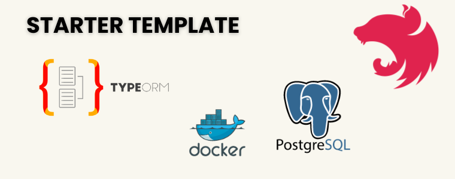

# Starter template for NestJS TypeORM PostgreSQL Docker



## Description

Ready to use! NestJS, PostgresSQL, TypeORM Dockerized for your new application.

#### Make sure you have installed docker.

## Running the app

```bash
$ npm run start

$ npm run build

$ docker compose up
```

## Stay in touch

- Author - Atakan Reyhanioglu 
- E-Mail - atakan.reyhanioglu@gmail.com

######Hope you will find that template useful to get you started.

Kindest regards.
